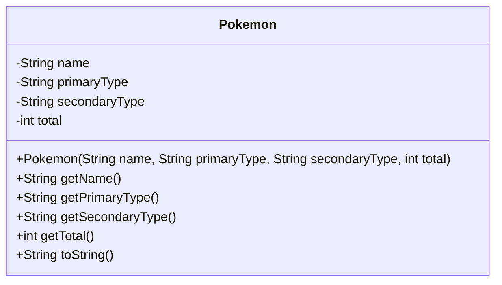

# UML Diagram (Mermaid)

```mermaid
classDiagram
    class Pokemon {
        -String name
        -String primaryType
        -String secondaryType
        -int total
        +Pokemon(String name, String primaryType, String secondaryType, int total)
        +String getName()
        +String getPrimaryType()
        +String getSecondaryType()
        +int getTotal()
        +String toString()
    }
```

> Export this diagram to PNG or PDF if required for submission.
